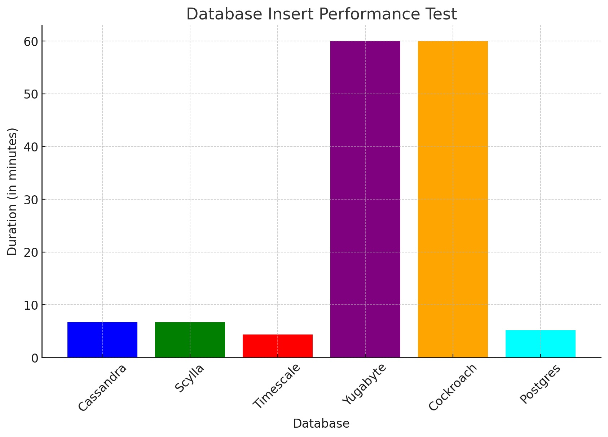
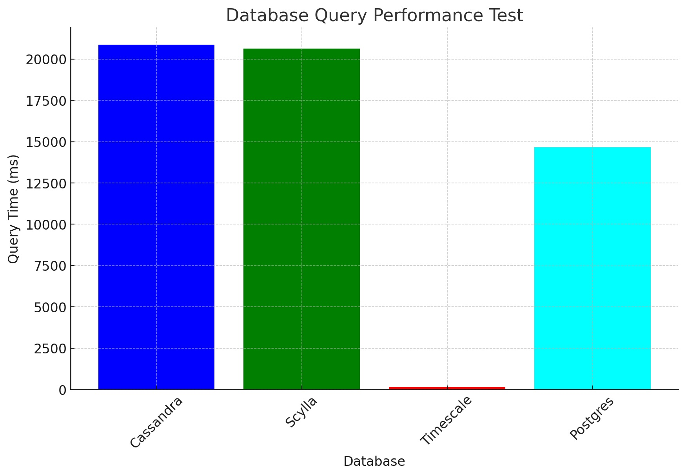

# Cassandra, it’s not you, it’s us

I want you to know that you are probably an amazing product that has so much to offer to the world. However, it sadly just isn’t working out for us anymore.

We've encountered challenges such as escalating costs, inconsistent write and read performances, and setup misalignments that have constrained our growth. Of course, this is not entirely your fault, we set you up to fail with our infrastructure and use cases.

I hope we can part on good terms, with mutual respect and appreciation for the time we shared.  
I wish you all the happiness, success, and fulfilment in the world, and I hope you find a company that complements your life in the way you deserve.

Thank you for understanding, and I truly wish you the best.

Yours truly, Vandebron

## Our Data Storage Prince Charming

A list of some of the qualities we are looking for:
- Kindness and compassion. 
- High availability.
- Low Maintenance.
- Ability to store large volumes of data (currently around 10TB), though not everything has to be queried fast.
- Capable of ingesting real-time energy usage data (every 15 minutes per customer, possibly higher frequency in the future).
- Ideally, we can use our current tech stack as much as possible (flyway migrations, roundtrip tests, spark).
- Ideally, use as few different database technologies as possible.
- It does not need to be horizontally scalable, due to moving from 1 central data storage to a separate data storage per service.

With enough work, time and commitment, Cassandra could have fulfilled most of these requirements. However, love is a two-way street, and we didn't put in the time and effort to make it work.

## Speed Dating Round
Some potential suitors we considered for replacing Cassandra:

#### ScyllaDB
ScyllaDB is very similar to Cassandra. It should have better performance but still have (almost) all the same functionality as Cassandra.

#### PostgreSQL
PostgreSQL is a relational database. We already use it extensively in our services.

#### Cockroach
It is similar to PostgreSQL but with some limitations: [Known Limitations in CockroachDB v23.2](https://www.cockroachlabs.com/docs/stable/known-limitations.html)

It is horizontally scalable, which is an advantage over PostgreSQL when it comes to high availability and fault tolerance. We are also currently using it in some of our services.

#### Timescale
Timescale is a PostgreSQL extension that uses the same query layer, but a different storage layer, to have efficient time series-related features.

It can also distribute data, but this is still in early access and is not recommended.

#### Yugabyte

Yugabyte is a PostgreSQL extension to make PostgreSQL into a distributed database.

## Comparisons

To determine the most suitable match, we did some quick performance tests. One where we inserted 2 million + weather data records as fast as possible via recurring inserts, to see how easy it would be to migrate over to. And another test to determine general query speed.

### Write Speed Results

Note that the test results are not 100% fair, because Timescale and Postgres don’t have to distribute the data over multiple nodes (though Timescale does have 2 replicas), and Cassandra already contained a lot of data (though with some testing timescale didn’t seem to become slower when it already had more data). For Yugabyte and Cockroach, we gave up after 1 hour. Also, the tests were done with the existing setup for Cassandra.

### Query Speed Results

We also did some tests to query aggregated data from streaming data.
-   For this, we copied over 2.6M rows to each database.
-   For this data we need to aggregate (sum) some values per 15-minute time block).
-   For Cassandra/Scylla, this is done via spark.
-   For timescale use buckets based on timestamps.
-   For Postgres by grouping on floor(extract(epoch from timestamp) / 60 / 15)

## Our Happily Ever After

Timescale emerged as the clear winner here, not just for its performance in the above tests, but also for its seamless integration with our existing PostgreSQL setup. This compatibility allows us to maintain our current libraries and reduce code complexity, making Timescale an ideal choice for our time series data. At the same time, we continue to rely on Postgres for our other needs.

Cassandra, you won’t be missed.