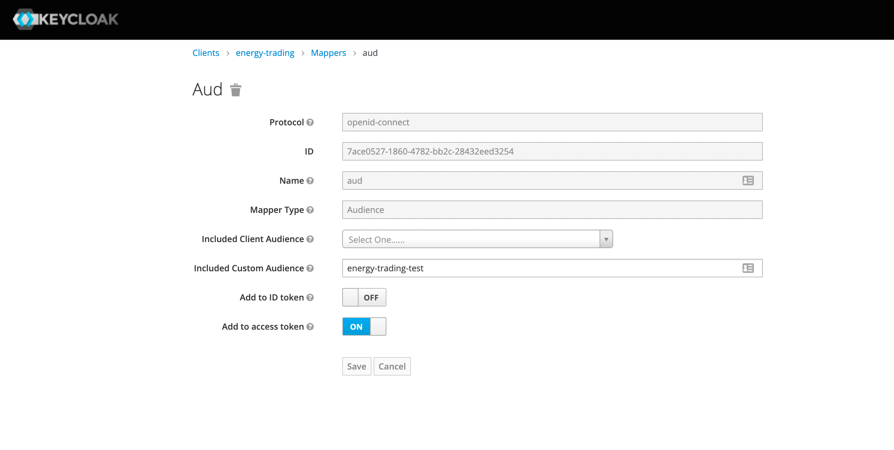
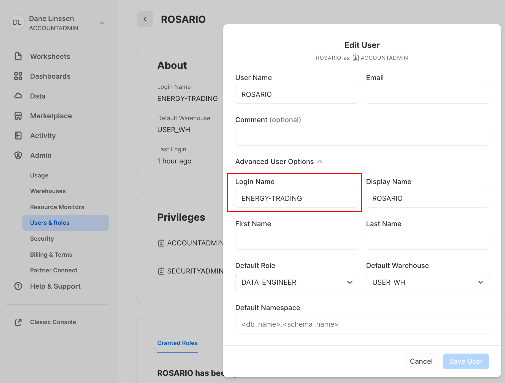

# Authenticate Snowflake rest api via Keycloak

Here in Vandebron  we use Keycloak as our identity and access management (IAM) solution and Snowflake as our data warehousing platform. 
Keycloak is a powerful and extensible solution for managing user identities and access control, making it a popular choice for organizations seeking a comprehensive and open-source IAM platform.
Snowflake is designed to handle and analyze large volumes of data with speed and efficiency. It is known for its scalability, flexibility, and ease of use in managing and analyzing diverse and massive datasets.

## Accessing Snowflake data via Rest API

There are several ways to access data in Snowflake one of these are the Snowflake rest api, they are a comprehensive set of REST APIs for managing and interacting with various aspects of the Snowflake Data Cloud, including account management, data loading, querying, and more.
These REST APIs allow developers to programmatically perform tasks such as executing SQL queries, managing virtual warehouses, and administering user roles. They are designed to enable automation and integration with other applications and services.

## Why via Rest Api?

The Snowflake SQL API is a REST API that you can use to access and update data in a Snowflake database. You can use this API to develop custom applications and integrations that can perform most of the queries you need. More info here: [Snowflake rest api](https://docs.snowflake.com/en/developer-guide/sql-api/index)

We decided to connect our microservices to snowflake via rest api mainly because we consider this mechanism the best way to decouple database processing with backend processing in fact the queries issued via the endpoint are processed inside Snowflake ecosystem asynchronously.

The service can poll snowflake to monitor the request until it is completed. See [Sql api response](https://docs.snowflake.com/en/developer-guide/sql-api/handling-responses) .

Using api communication has other very good benefits:

- No additional library dependency
- No Additional spark connectors
- Since there is no way to run snowflake on a local machine unit test a snowflake connection would have been very hard ( impossible ). With Rest api communication we can unit test snowflake api client using contract test. ( one way contract test is better than nothing )

## Snowflake Authentication

Snowflake provides a convenient way to authenticate to it using “any” OAuth authentication server. Our authentication server is Keycloak so in the following sections you will learn how to integrate Keycloak with Snowflake.
Resources to this topic can be found here [auth-ext-overview ](https://docs.snowflake.com/en/user-guide/oauth-ext-overview)  and here: [oauth-ext-custom](https://docs.snowflake.com/en/user-guide/oauth-ext-custom)


## Keycloak side

You need to configure your client to return in the JWT access token the following claims:

```
{
"aud": "<audience_url>",
"iat": 1576705500,
"exp": 1576709100,
"iss": "<issuer_url>",
"scope": [
"session:role-any"
]
}
```

most of them are returned by default. Aud claims is the only one you should add
To add `aud` claim you can add a new mapper to your client with type Audience see image:



**Note**: You need to add a custom audience with the value **equal** to the login_name attribute value in snowflake. The audience value will be used to look up to the right user in snowflake integration

Then you need to add the snowflake scope to your scope list: session:role-any
Finally you can check that your token is correct:

```
{
.....
"iss": "https://test.vdbinfra.nl/auth/realms/vandebron",
"scope": "session:role-any",
"aud": "energy-trading-test",
....
}
```

The `aud` must contain only the snowflake login_name. For instance, a token such as the following will not work (multiple audiences):"aud": [     "batterypack-services-test",     "account"   ],

## Snowflake side

How to find keycloak public key: [stackoverflow](https://stackoverflow.com/a/57457227)
Required: `ACCOUNTADMIN` rights in Snowflake.
Example integration command:

```
create or replace security integration external_oauth_keycloak_test
type = external_oauth
enabled = true
external_oauth_type = custom
external_oauth_issuer = 'https://test.vdbinfra.nl/auth/realms/vandebron'
external_oauth_rsa_public_key = '<public_key>'
external_oauth_audience_list = ('energy-trading-test')
external_oauth_scope_mapping_attribute = 'scope'
external_oauth_token_user_mapping_claim = 'aud'
external_oauth_any_role_mode = 'ENABLE'
external_oauth_scope_delimiter = ' '
external_oauth_snowflake_user_mapping_attribute = 'login_name';
```

Note: the external_oauth_scope_delimiter setting must be enabled separately by Snowflake support.
Next, you need to set the login name for the user you want associate with the integration:



### Example

Let’s authenticate with keycloak as we do normally:

```
curl --location --request POST 'https://keycloak.test-backend.vdbinfra.nl/auth/realms/vandebron/protocol/openid-connect/token/' \
--header 'Content-Type: application/x-www-form-urlencoded' \
--data-urlencode 'grant_type=client_credentials' \
--data-urlencode 'client_id=energy-trading' \
--data-urlencode 'client_secret=<secret>'
```

Now you should get the token. Optional: van verify the token directly in snowflake with SQL:

```
SELECT SYSTEM$VERIFY_EXTERNAL_OAUTH_TOKEN( '<token>' )
```

Use it in the snowflake statement endpoint. For example:

```
curl --location --request POST 'https://<my_snowflake_identifier>.eu-central-1.snowflakecomputing.com/api/v2/statements?async=true' \
--header 'Authorization: Bearer <yourtoken> \
--header 'Content-Type: application/json' \
--data-raw '{
"statement": "select \"data\" as prediction, to_number(\"lats\", 10, 4) as lats, to_number(\"lons\", 10, 4) as lons, \"scaledValueOfFirstFixedSurface\" as scaled_value_of_first_fixed_surface, to_timestamp_tz( concat(\"dataDate\", lpad(\"dataTime\", 4, 0)) || '\''+0'\'', '\''yyyymmddhh24mi+tzh'\'') as model_datetime, to_timestamp_tz( concat(\"validityDate\", lpad(\"validityTime\", 4, 0)) || '\''+0'\'', '\''yyyymmddhh24mi+tzh'\'') as predicted_datetime, insert_date_snowflake, current_timestamp()::timestamp_tz(9) as insert_date_staging from raw.icon_eu.alhfl_s;"
}'
```

NB: It is important to use the proper snowflake base url. In my case I am using https://<my_snowflake_identifier>.eu-central-1.snowflakecomputing.com/ where <my_snowflake_identifier> is my account identifier which was authorised during configuration phase the snowflake user the token is referring to in the clientId claim.
You should get a response such as:

```
{
"code": "333334",
"message": "Asynchronous execution in progress. Use provided query id to perform query monitoring and management.",
"statementHandle": "01aafc80-3201-abed-0001-4a0e00e52816",
"statementStatusUrl": "/api/v2/statements/01aafc80-3201-abed-0001-4a0e00e52816"
}
```

Now you can follow the async operation to the following get endpoint:

```
https://<my_snowflake_identifier>.eu-central-1.snowflakecomputing.com/api/v2/statements/01aafc80-3201-abed-0001-4a0e00e52816
```

It will return 202 if the processing is still ongoing. It will return 200 and the actual result when processing ends.

Happy coding!