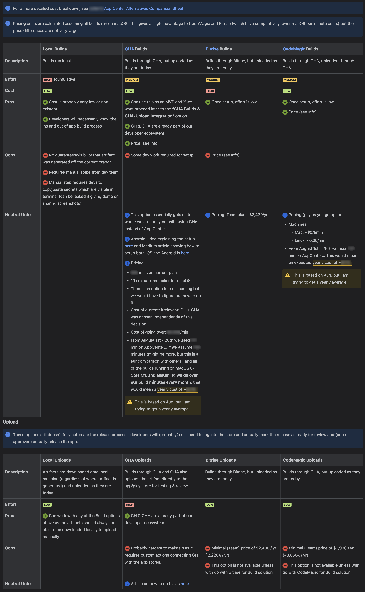

## Why?
Test. This seems like a lot of work... Why not go with an off-the-shelf solution from something like 

## Some notes before we get started
- We actually use this workflow to build two apps, one of which can be white-labeled, so we have an additional `app` input which makes things a bit trickier. This is why we have the `env-variable-prep-android.sh` which normalizes the variable names used for secrets so those secrets and build file names, etc. can be easily used. If you just have a single app you probably don't need this script.
- The code below is only for the build process. Though the ADR considered how this would affect future decisions about artifact upload automation and rolling out releases for internal testing, nothing about that is automated here.

## Implementation
1. Add the files below. Nothing in this setup should effect App Center but it is good to check in your changes to a branch and test those against the regular App Center build flow. File contents can be found in the [Appendix](#appendix)

    | Android | iOS |
    |------|-------------|
    | `.github/workflows/mobile-apps-build-android.yaml` | `.github/workflows/mobile-apps-build-ios.yaml` |
    | `env-variable-prep-android.sh` | `env-variable-prep-ios.sh` |
    | `env-file-prep.sh` | `env-file-prep.sh` |
    | `fastlane/Fastfile` | `fastlane/Fastfile` |
    | N/A for Android | `fastlane/Gymfile` |

2. Set up act to test your workflow locally. WARNING: GitHub Actions doesn't let you run a `workflow_dispatch` action until it has been merged into the main branch so you'll want to get the basic setup above in place before you start tinkering with application logic or things that could effect App Center. Also note that while `act` is helpful for getting the basics in place, it's unlikely you'll be able to test the complete process locally because, at least for us a) Android pipeline crashes halfway through the `Build App` step with an error of `Gradle build daemon disappeared unexpectedly (it may have been killed or may have crashed)`, and b) iOS tries to install a fresh copy of Xcode

    1. Follow installation instructions on [their User Guide](https://nektosact.com/installation/index.html)
    2. Create a `~/.actrc` file that looks like this

        <pre style="font-size: 0.8rem; display: flex;">
          <code class="language-bash">
          --container-architecture linux/amd64
          --secret GITHUB_TOKEN=$GITHUB_TOKEN
          </code>
        </pre>
        
    3. Get your `$GITHUB_TOKEN` env variable in place

        1. Install [gh, the GitHub cli](https://cli.github.com/)
        2. Modify shells (zsh shown below)

            <pre style="font-size: 0.8rem; display: flex;">
              <code class="language-bash">
              export GITHUB_TOKEN="$(gh auth token)"
              </code>
            </pre>

        3. Close and re-open your terminal. Test to make sure you can see your `GITHUB_TOKEN` envrionment variable

    4. Set up a temporary local file for secrets and GHA trigger inputs. WARNING: Once you’re done, remember to delete that .secret file so it’s not hanging around on your file system!! (or just don’t create it in the first place unless you really need it)

        <table className="wide-table">
          <thead>
            <tr>
              <th>my-app-input.json</th>
              <th>.secrets</th>
            </tr>
          </thead>
          <tbody>
            <tr>
              <td>
                <pre style="font-size: 0.8rem; display: flex;">
                  <code class="language-json">
        {
          "action": "workflow_dispatch",
          "inputs": {
            "app": "ev",
            "environment": "test",
            "essent-release": false
          }
        }
                  </code>
                </pre>
              </td>
              <td>
                <pre style="font-size: 0.8rem; display: flex;">
                  <code class="language-bash">
        ANDROID_STORE_PASSWORD="someSecr3ts"
        ANDROID_KEY_PASSWORD="YouWantQuotesBecause*s_etc.WillScrewYouUp"
        MAPBOX_READ_TOKEN=shhhhh.Its.asecret
                  </code>
                </pre>
              </td>
            </tr>
          </tbody>
        </table>

    5. Run your workflow like this. As far as I know, you can only run the iOS workflow locally if you're on a mac. To do that you'll need to provide an additional parameter: `-P macos-latest=-self-hosted`
      
        <pre style="font-size: 0.8rem; display: flex;">
          <code class="language-bash">
          act \
          --workflows .github/workflows/mobile-apps-build-android.yaml \
          --eventpath="${HOME}/Documents/IT/GitHub Actions/Mobile Apps/my-app-input.json" \
          --secret-file="${HOME}/Documents/IT/GitHub Actions/Mobile Apps/.secrets"
          </code>
        </pre>

3. Once you're happy with your changes locally, send a PR & merge them in!
4. Go to the "Actions" tab at the top of your GitHub repo. You should now see your actions for building iOS and Android on the left. Since it's a `workflow_dispatch` action you'll trigger the actions manually.

    

      
    

5. More than likely these won't work the first time. Time to go back and adjust. Note that since the workflow is now in the main branch you can test your workflow changes on a feature branch. Just select your feature branch in the "Branch" dropdown shown above.

## Other Things to Note

<ul>
  <li>App Center gives you the ability to write `appcenter-pre-build.sh` and `appcenter-post-build.sh` scripts. The `env-file-prep.sh` is basically that same thing, just without the context of appcenter.</li>
  <li>One of our apps is using MapBox which needs a `.netrc` in the root directory. If you need something similar, you can add a step to your action by adding the code shown in the the "optional mapbox" part + the `./my-app/prep-mapbox.sh` in the [Appendix](#appendix).</li>
</ul>

## Benefits
- It regularly took over 50 minutes for our mobile app to build in App Center. Part of that could have very likely be improved by adjusting App Center configurations & how we store and bundle app assets but after migrating our builds to GitHub Actions our app build times are now down to 22 minutes - More than twice as fast!
- All the rest of the software at Vandebron (backend services in Scala and Python and frontend applications in Typescript + React) is built using GitHub Actions. This move brings mobile apps in line with all other software. This move to GHA for mobile builds has forced several of our mobile devs to get our hands dirty in GHA which is great because we can now play a role in the larger CICD discussions.
- We have full control over our CICD pipeline for mobile builds. In the future we can integrate more Fastlane commands to further automate the release process.
- Though it's not the point of this blog, we did a full ADR (shown below) which initiated the work here.
  

## Appendix
<pre style="font-size: 0.8rem; display: flex;">
  <code class="language-yaml" className="small-code">
  # file: .github/workflows/mobile-apps-build-android.yaml
  ---
  name: Mobile App Build for Android
  run-name: "Build: Android ${{ inputs.environment }}"
  on:
    workflow_dispatch:
      inputs:
        environment:
          description: 'Environment'
          required: true
          type: choice
          options:
            - test
            - acceptance
            - production
  jobs:
    build:
      name: Build app for android
      runs-on: ubuntu-latest
      environment: ${{ inputs.environment }}
      steps:

        - name: Checkout ${{ github.repository }}
          uses: actions/checkout@v4.2.2

        - name: Prep Env Variables
          id: prep-env-variables
          working-directory: mobile
          env:
            ENVIRONMENT: ${{ inputs.environment }}  # production | test | acceptance
            ANDROID_KEY_PASSWORD: ${{ secrets.ANDROID_KEY_PASSWORD }}
            ANDROID_STORE_PASSWORD: ${{ secrets.ANDROID_STORE_PASSWORD }}
          run: bash ./env-variable-prep-android.sh

        - name: Create .env file
          working-directory: mobile
          env:
            ENVIRONMENT: ${{inputs.environment}}
          run: bash ./env-file-prep.sh

        - name: Enable Corepack
          run: corepack enable

        - name: Setup NodeJS
          id: setup-node
          uses: actions/setup-node@v4.1.0
          with:
            node-version: 18.x
            registry-url: https://registry.npmjs.org
            cache: 'yarn'
            cache-dependency-path: mobile/my-app/yarn.lock

        - name: Setup Java
          uses: actions/setup-java@v4.6.0
          with:
            distribution: 'temurin'
            java-version: '20'
            cache: 'gradle'
        - name: Setup Android SDK  # sadly no caching capabilities here
          uses: android-actions/setup-android@v3.2.2
          with:
            log-accepted-android-sdk-licenses: false
            packages: 'tools'   # Default is 'tools platform-tools but we don't need platform-tools for packaging'

        - name: Set up ruby env # Fastlane is a "Ruby gem"
          uses: ruby/setup-ruby@v1
          with:
            ruby-version: '3.3.0'
            bundler-cache: true

        - name: Install Gem Bundler
          working-directory: mobile/my-app
          run: |
            gem install bundler
            bundle install --quiet

        # Install Dependencies
        - name: Yarn Install
          working-directory: mobile/my-app
          run: yarn install --immutable

        # Build
        - name: Build App
          run: bundle exec fastlane android build --env "$FASTLANE_ENV_INFERRED_BRAND.$ENVIRONMENT"
          working-directory: mobile/my-app
          env:
            ENVIRONMENT: ${{ inputs.environment }}
            ANDROID_KEYSTORE_FILE: ${{ steps.prep-env-variables.outputs.android-keystore-file }}
            ANDROID_KEY_ALIAS: ${{ steps.prep-env-variables.outputs.android-key-alias }}
            ANDROID_STORE_PASSWORD: ${{ steps.prep-env-variables.outputs.android-store-pass }}
            ANDROID_KEY_PASSWORD: ${{ steps.prep-env-variables.outputs.android-keystore-pass }}
            FASTLANE_ANDROID_FLAVOR: ${{ steps.prep-env-variables.outputs.fastlane-android-flavor }}

        # Upload
        - name: Upload application
          uses: actions/upload-artifact@v4
          with:
            name: ${{steps.prep-env-variables.outputs.artifact-name}}
            path: "mobile/my-app/android/app/build/outputs/bundle/${{ steps.prep-env-variables.outputs.fastlane-android-flavor }}Release/app-${{ steps.prep-env-variables.outputs.fastlane-android-flavor }}-release.aab"
            retention-days: 30
  </code>
</pre>

<pre style="font-size: 0.8rem; display: flex;">
  <code class="language-yaml">
  # file: .github/workflows/mobile-apps-build-ios.yaml
  ---
  name: Mobile App Build for iOS
  run-name: "Build: iOS, ${{ inputs.environment }}"

  on:
    workflow_dispatch:
      inputs:
        environment:
          description: 'Environment'
          required: true
          type: choice
          options:
            - test
            - acceptance
            - production

  jobs:
    build:
      name: Build app for iOS
      runs-on: macos-latest
      environment: ${{ inputs.environment }}
      steps:

        - name: Checkout ${{ github.repository }}
          uses: actions/checkout@v4.2.2

        - name: Prep Env Variables
          id: prep-env-variables
          working-directory: mobile
          env:
            ENVIRONMENT: ${{ inputs.environment }}  # production | test | acceptance
            IOS_MOBILE_PROVISIONING_PROFILE: ${{ secrets.THUIS_IOS_MOBILE_PROVISIONING_PROFILE }}
          run: bash ./env-variable-prep-ios.sh

        - name: Create .env file
          working-directory: mobile
          env:
            ENVIRONMENT: ${{inputs.environment}}
          run: bash ./env-file-prep.sh

        - name: Import Build Certificate from Secrets
          uses: apple-actions/import-codesign-certs@v3
          with:
            p12-file-base64: ${{ secrets.IOS_BUILD_CERTIFICATE_P12 }}
            p12-password: ${{ secrets.IOS_BUILD_CERTIFICATE_P12_PASSWORD }}

        - name: Import Mobile Provisioning Profile
          uses: nickwph/apple-provisioning-profile-action@v1.0.0
          with:
            profile-base64: ${{ steps.prep-env-variables.outputs.ios-mobile-provisioning-profile }}

        - name: Setup NodeJS
          id: setup-node
          uses: actions/setup-node@v4.2.0
          with:
            node-version: 20.x

        - name: Install XCode
          uses: maxim-lobanov/setup-xcode@v1
          with:
            xcode-version: 16.1

        - name: Install Ruby
          uses: ruby/setup-ruby@v1
          with:
            ruby-version: 3.3.0

        - name: Install Bundler
          run: gem install bundler

        # TODO: Cache node_modules similarly to how Pods are cached (compare hash of yarn.lock)
        - name: Yarn Install
          working-directory: mobile/${{ inputs.app }}
          run: yarn install --immutable

        # TODO: Cache Gems similarly to how Pods are cached (compare hash of Gemfile.lock)
        - name: Install Gems
          run: bundle install
          working-directory: mobile/${{ inputs.app }}

        - name: Cache CocoaPods dependencies
          uses: actions/cache@v4
          env:
            FILES_GLOB: mobile/${{ inputs.app }}/ios/Podfile.lock
          with:
            path: |
              mobile/${{ inputs.app }}/ios/Pods
            key: ${{ runner.os }}-pods-${{ hashFiles(env.FILES_GLOB) }}
            restore-keys: |
              ${{ runner.os }}-pods-

        - name: Install Pods
          working-directory: mobile/${{ inputs.app }}/ios
          run: bundle exec pod install

        - name: Build iOS App
          env:
            SCHEME: ${{ steps.prep-env-variables.outputs.ios-scheme }}
          run: bundle exec fastlane gym
          working-directory: mobile/${{ inputs.app }}

        # Upload
        - name: Upload application
          uses: actions/upload-artifact@v4
          with:
            name: ${{steps.prep-env-variables.outputs.ios-scheme}}
            path: "mobile/${{ inputs.app }}/ios/build/${{ steps.prep-env-variables.outputs.ios-scheme }}.ipa"
            retention-days: 30
            overwrite: true
            if-no-files-found: error
  </code>
</pre>

<pre style="font-size: 0.8rem; display: flex;">
  <code class="language-bash">
  # file: env-variable-prep-android.sh
  #!/bin/bash

  ARTIFACT_NAME="mobile-my-app-${ENVIRONMENT}-release"
  FASTLANE_ANDROID_FLAVOR="${ENVIRONMENT}"
  {
    echo "artifact-name=${ARTIFACT_NAME}"
    echo "fastlane-android-flavor=${FASTLANE_ANDROID_FLAVOR}"
  } | tee -a "$GITHUB_OUTPUT"

  # Secrets should not get sent out over tee command (which also prints it to console)
  {
    echo "android-key-alias=my-app"
    echo "android-keystore-file=../keystores/my-app.jks"
    echo "android-keystore-pass=${ANDROID_KEY_PASSWORD}"
    echo "android-store-pass=${ANDROID_STORE_PASSWORD}"
  } >> "$GITHUB_OUTPUT"
  </code>
</pre>

<pre style="font-size: 0.8rem; display: flex;">
  <code class="language-bash">
  # file: env-variable-prep-ios.sh
  #!/bin/bash

  # Secrets should not get sent out over tee command (which also prints it to console)
  {
    echo "ios-mobile-provisioning-profile=${IOS_MOBILE_PROVISIONING_PROFILE}"
  } >> "$GITHUB_OUTPUT"
  </code>
</pre>

<pre style="font-size: 0.8rem; display: flex;">
  <code class="language-bash">
  # file: env-file-prep.sh
  #!/usr/bin/env bash

  #####################################################
  # Creates an .env file for use in react-native-config
  # This script should be run from the /mobile folder
  #####################################################

  if [ "${ENVIRONMENT}" != "test" ] && [ "${ENVIRONMENT}" != "acceptance" ] && [ "${ENVIRONMENT}" != "production" ]; then
      echo "ENVIRONMENT is not set, using 'production' as default."
      ENVIRONMENT=production
  fi

  echo "Copying 'my-app/.env.${ENVIRONMENT}' to 'my-app/.env'..."
  cp "my-app/.env.${ENVIRONMENT}" "my-app/.env"

  echo "Success!"
  </code>
</pre>

<pre style="font-size: 0.8rem; display: flex;">
  <code class="language-bash">
  # file: ./fastlane/Fastfile
  opt_out_usage

  platform :android do
    desc 'Build app for Android'
      lane :build do
        build_android_app(
          task: 'bundle',
          flavor: ENV['FASTLANE_ANDROID_FLAVOR'],
          build_type: 'Release',
          project_dir: 'android/',
          print_command: true,
          print_command_output: true,
        )
      end
  end
  </code>
</pre>

<pre style="font-size: 0.8rem; display: flex;">
  <code class="language-bash">
  # file: ./fastlane/Gymfile
  scheme(ENV['SCHEME'])
  workspace("ios/my-app.xcworkspace")
  export_options("ios/exportOptions.plist")
  output_directory("ios/build")
  output_name(ENV['SCHEME'])
  </code>
</pre>

<pre style="font-size: 0.8rem; display: flex;">
  <code class="language-yaml">
  # file: .github/workflows/mobile-apps-build-android.yaml and .github/workflows/mobile-apps-build-ios.yaml (optional mapbox)
  - name: Create Mapbox .netrc file (EV only)
    if: ${{ inputs.app == 'my-app' }}
    working-directory: mobile
    env:
      MAPBOX_READ_TOKEN: ${{ secrets.MAPBOX_READ_TOKEN }}
    run: bash ./my-app/prep-mapbox.sh
  </code>
</pre>

<pre style="font-size: 0.8rem; display: flex;">
  <code class="language-bash">
  # file: ./my-app/prep-mapbox.sh
  #!/usr/bin/env bash
  
  # WARN: DO NOT use tee here (it prints to console)
  {
    echo "machine api.mapbox.com"
    echo "login mapbox"
    echo "password ${MAPBOX_READ_TOKEN}"
  } >> ~/.netrc
  chmod 0600 ~/.netrc
  </code>
</pre>

## Test

<table>
  <thead>
    <tr>
      <th>Header 1</th>
      <th>Header 2</th>
    </tr>
  </thead>
  <tbody>
    <tr>
      <td style="max-width: 40vw;">
      <pre style="font-size: 0.8rem; display: flex;">
        <code class="language-yaml">
        # file: .github/workflows/mobile-apps-build-android.yaml and .github/workflows/mobile-apps-build-ios.yaml (optional mapbox)
        - name: Create Mapbox .netrc file (EV only)
          if: ${{ inputs.app == 'my-app' }}
          working-directory: mobile
          env:
            MAPBOX_READ_TOKEN: ${{ secrets.MAPBOX_READ_TOKEN }}
          run: bash ./my-app/prep-mapbox.sh
        </code>
      </pre>
      </td>
      <td style="max-width: 40vw;">
        <pre style="font-size: 0.8rem; display: flex;">
          <code class="language-bash">
          # file: ./my-app/prep-mapbox.sh
          #!/usr/bin/env bash
          # WARN: DO NOT use tee here (it prints to console)
          {
            echo "machine api.mapbox.com"
            echo "login mapbox"
            echo "password ${MAPBOX_READ_TOKEN}"
          } >> ~/.netrc
          chmod 0600 ~/.netrc
          </code>
        </pre>
      </td>
    </tr>
  </tbody>
</table>

