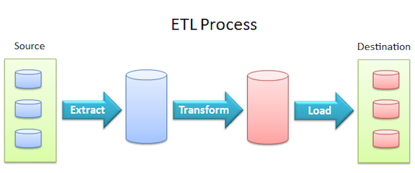
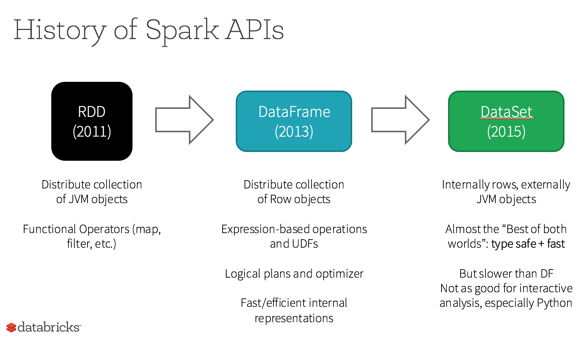

# Spark article Part 1
Here at Vandebron, we have several projects which need to compute large amounts of data. In order to achieve acceptable results we had to choose a computing tool that should have helped us to build such algorithms.

As you may have read in other articles our main backend language is Scala so the natural choice to build distributed parallel algorithms was indeed Spark.

## What is Spark
We will briefly introduce spark in the next few lines and then we will dive deep into some of its key concepts.
Spark is an ETL distributed tool. ETL are three phases which describe a general procedure for moving data from a source to a destination.


* ***Extract*** is the act of retrieving data from a data source which could be a database or a file system.
* ***Transform*** is the core part of an algorithm. As you may know, functional programming is all about transformation. Whenever you write a block of code in Scala you go from an initial data structure to a resulting data structure, the same goes with spark but the data structures you use are specific spark structures we will describe later.
* ***Load*** is the final part. Here you need to save (load) the resulting data structure from the transformation phase to a data source. This can either be the same as the extract phase or a different one.
* ***Distributed***: Spark is meant to be run in a cluster of nodes. Each node runs its own JVM and every spark data structure can/should be distributed among all the nodes of the cluster (using serialization) in order to parallelize the computation.


### Spark data structure: RDD, DataFrame and Dataset



The core of spark is its *distributed resilient dataset ( RDD ).*  An ***RDD*** is a collection of elements partitioned across the nodes of the cluster that can be operated on in parallel. *Extracting* data from a source creates an RDD. Operating on the RDD allows to *transform* the data. Writing the RDD *loads* the data into the end target ( like a database for example ).
They are made to be distributed over the cluster in order to parallelize the computation.
A ***DataFrame*** is an abstraction on top of an RDD. It is the first attempt of spark (2013) to organize the data inside and RDD with an SQL-like structure. With dataframe you can actually make transformation in an sql fashion.  Every element in a dataframe is a Row and you can actually transform a dataframe to another by adding or removing columns.
A ***DataSet*** finally is a further abstraction on top of a dataframe to organize data in an OO fashion (2015). Every element in a dataset is a case class and you can operate transformation in a scala fashion from a case class to another.

## Spark in action
Let’s see now some code samples from our code base to illustrate in more detail each of ETL phases.

Extract
The extraction phase is the first step in which you gather the data from a datasource.
```scala
val allConnections = sparkSession
.read
.jdbc(connectionString, tableName, props)

val selectedConnections = allConnections
.select(ColumnNames.head, ColumnNames.tail: _*)

val p4Connections = selectedConnections
.filter(allConnections("HasP4Day activated").equalTo(1))
.filter(allConnections("HasP4INT activated").equalTo(1))
.as[Connection]

p4Connections.show()

```
For most people the extraction phase is just the first line ( the invocation to the read method ), they are not wrong because extracting means reading data from a datasource ( in this case an SQL server database ). I decided to include in this phase also some filtering and projection operations because I think these are not really part of the algorithm, this is still the preparation phase before you actually process the data. We can ultimately say that *preparing the data* is something in between extraction and transformation therefore it is up to you to decide which phase it belongs to.


### Transform
Transformation phase is the core of the algorithm. Here you actually process your data to reach your final result. 
```scala
usageDF
.groupBy('ConnectionId, window('ReadingDate, "1 day"))
.agg(
	sum('Consumption).as("Consumption"),
	sum('OffPeak_consumption).as("OffPeak_consumption"),
	sum('Peak_consumption).as("Peak_consumption"),
	sum('Production).as("Production"),
	sum('OffPeak_production).as("OffPeak_production"),
	sum('Peak_production).as("Peak_production"),
	first('ReadingDate).as("ReadingDate"),
	first('marketsegment).as("marketsegment"),
	collect_set('Source).as("Sources"),
	collect_set('Tag).as("Tags"),
	max('Last_modified).as("Last_modified")
)
.withColumn(
	"Tag", when(array_contains('Tags, “Interpolated”),
lit(Tag.Interpolated.toString)).otherwise(lit(“Measured”)))
.withColumn("Source",
when(size('Sources) > 1,
lit(Source.Multiple.toString)).otherwise(mkString('Sources)))
.orderBy('ConnectionId, 'ReadingDate)
.drop("window", "sources", "tags")

```
In this specific example we are processing connection usage data by aggregating it daily. In the `usageDF` we have 15 minutes interval usage data, now we want to show to the user the same data but with a different aggregation interval ( 1 day ). So we group the whole data by connection id and window the reading date by 1 day ( A window function calculates a return value for every input row of a table based on a group of rows [Introducing Window Functions in Spark SQL - The Databricks Blog](https://databricks.com/blog/2015/07/15/introducing-window-functions-in-spark-sql.html). Once the data is grouped we can aggregate it, using the `agg` method which allows us to call the aggregation functions over the dataframe ( for example: `sum`, `first`,`max` or `collect_set` ).  Successively we transform the dataframe in order to suit our visualization needs, the methods used are self-explanatory and the documentation is very clear. [Getting Started - Spark 3.0.1 Documentation](https://spark.apache.org/docs/latest/sql-getting-started.html)

### Load
The final phase is the one which `save, put, show` the transformed data into the target data source.
```scala
dataFrame
.select(columns.head, columns.tail: _*)
.write
.cassandraFormat(tableName, keySpace)
.mode(saveMode)
.save()
```
In this specific case we will save our dataframe into a cassandra database. In spark, methods used to achieve the load phase are called *actions* . It is very important to distinguish spark actions from the rest because actions are the only ones which trigger spark to actually perform the whole transformation chain you have defined previously. 
If our transformation phase, we described above, wasn’t followed by an action ( for example `save` ) nothing would have happened, the software would have simply terminated without doing anything.

## One concept to rule them all
```scala
val rdd1 = sc.parallelize(1 to 10)
val rdd2 = sc.parallelize(11 to 20)
val rdd2Count = rdd1.map(
x => rdd2.values.count() * x //This will NEVER work!!!!
)
```
*One does not simply use RDD inside another RDD*. ( Same goes for Dataframes or Datasets).
This is a very simple concept which leads very often to lots of questions because many people just want to use spark as a normal scala library.  But this is not possible due to the inner distributed nature of spark and its data structures. We have said that an RDD is a resilient distributed dataset, let’s focus on the word *distributed*, it means that the data inside it is spread across the nodes of the cluster. Every node has its own JVM and it is called *Executor*, except for the master node where your program starts which is called *Driver*:


Your code starts from the Driver and a copy is distributed to all executors, this also means that each executor needs to have the same working environment of the Driver, for Scala it is not a problem since it just needs a JVM to run. ( but we will see that if you use *pySpark* you need to take extra care when you distribute your application.) Every spark data structure you have defined in your code will also be distributed across the executors and every time you perform a transformation it will be performed to each chunk of data in each executor.  Now let’s go back to our example, a `map` is a transformation on `rdd1` this means that block inside will be executed at the executor level, if we need `rdd2` to perform this block spark should somehow serialize the whole `rdd2` and send it to each executor.  You can understand now that _it is really not possible to serialize the whole RDD since it is by its nature already a distributed data structure_. So what can you do to actually perform such computation we showed in the example? The solution is “simple”: *prepare your data in such a way that it will be contained in one single RDD*. In order to do so you can take advantage of all the transformation functions Spark has to offer such `map` `join` `union` `reduce` etc.


## Next step…
We have explained all the main concepts of spark and we have shown some real snippets of our code base. In the next article I would like to show you a real life problem we have solved in our company using *pySpark*[Welcome to Spark Python API Docs! — PySpark 3.0.1 documentation](https://spark.apache.org/docs/latest/api/python/index.html). I will show you how to customize spark infrastructure in order to correctly parallelize the ETL algorithm you have built.


